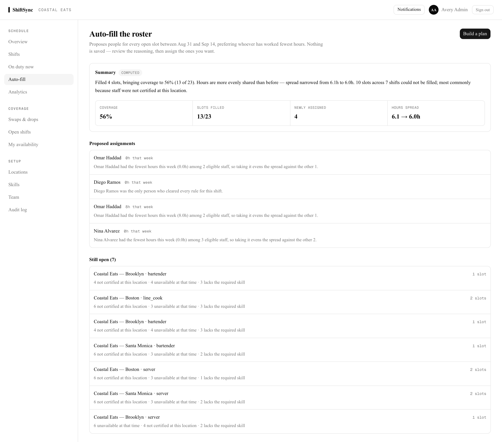
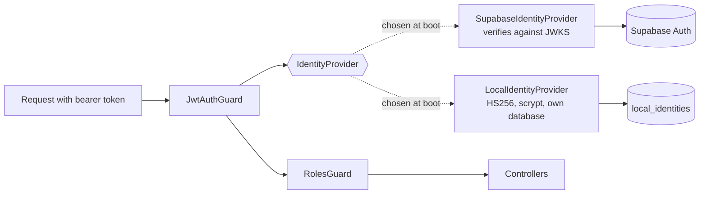
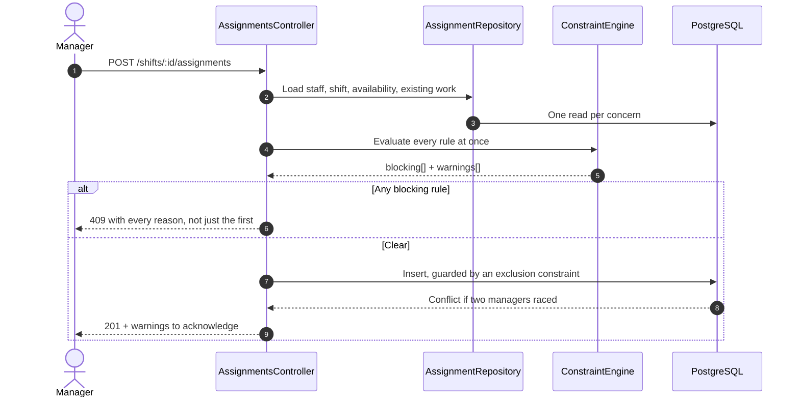

# ShiftSync — API

Staff scheduling for a restaurant group with four sites across two timezones.
NestJS, Prisma, PostgreSQL.

The hard part is not CRUD over shifts. It is that "ten hours rest between
shifts" has to mean ten real hours when one shift is in Brooklyn and the next
is in Santa Monica, and that a manager has to be able to explain to the person
who got Saturday night why it was them.

Frontend: [`shiftsync-fe`](../shiftsync-fe)



---

## Run it

```bash
docker compose up --build
```

Then open **http://localhost:3200**. The API is on **http://localhost:4000/api**
with Swagger at **/api/docs**.

**No accounts to create and no keys to obtain.** With no Supabase credentials
present the API runs its own identity provider, the database is seeded with 4
locations, 12 staff and three weeks of history, and you sign in with any seeded
account:

| Role | Email | Password |
|---|---|---|
| Admin | `admin@coastaleats.test` | `CoastalEats!2026` |
| Manager | `east-manager@coastaleats.test` | `CoastalEats!2026` |
| Staff | `sarah@coastaleats.test` | `CoastalEats!2026` |

Roles differ meaningfully: a manager cannot open Team or the Audit log, and
staff cannot open Analytics.

<details>
<summary>Running without Docker</summary>

```bash
# Postgres must have the auth-schema stub applied once — see docker/00-auth-schema.sql
psql "$DATABASE_URL" -f docker/00-auth-schema.sql

npm ci
cp .env.example .env
npx prisma migrate deploy
npm run seed
npm run start:dev        # :4000
```
</details>

---

## Identity is pluggable



Every controller, guard and service sits behind one `IdentityProvider`
interface. Which implementation runs is decided once, at boot: `AUTH_PROVIDER`
wins if set, otherwise the presence of Supabase credentials decides, otherwise
the self-hosted provider is used and says so in the logs.

That seam is why this repository can be cloned and run. Previously the Supabase
client **threw during module construction** when credentials were absent, so a
fresh clone could not start the process at all — not to serve a health check,
not to run a test.

| | Hosted (Supabase) | Self-hosted |
|---|---|---|
| Token | Verified against published JWKS | HS256, signed locally |
| Passwords | Never seen by this API | scrypt, per-user salt, constant-time compare |
| Sign-in | Browser talks to the vendor | `POST /api/auth/login` |
| Needs credentials | Yes | No |

The self-hosted provider is a development and evaluation path, not a claim to
be a hardened identity service. It has no refresh tokens, no lockout and no
password reset.

---

## What happens when someone is put on a shift



The engine returns **every** failure rather than stopping at the first, so a
manager fixing one problem does not discover the next on retry. Rules split
into blocking (certification, skill, availability, double-booking, minimum
rest, daily hours, a seventh consecutive day) and warnings that a manager may
knowingly accept.

The database keeps the final word: a Postgres exclusion constraint rejects
overlapping assignments even if two managers submit at the same instant.

---

## Auto-filling a roster

`POST /api/planner/plan` proposes people for every open slot in a window and
explains each choice. **It writes nothing** — the manager reviews and assigns.

The algorithm is greedy with a fairness objective, not a solver:

1. Score each shift's difficulty by how many people are eligible per open slot.
2. Fill the hardest first, because spending the only candidate for a hard shift
   on an easy one strands the hard one.
3. Within a shift, prefer whoever has the fewest hours that week; break ties on
   who has worked fewest premium shifts, so weekends rotate.
4. Re-evaluate eligibility after every placement, since placing someone changes
   rest and overlap for everyone after them.

A real solver would find better rosters. This runs inside a request, adds no
dependency, and every decision reduces to one sentence — which is what a
manager actually needs when the roster is questioned.

The written summary is generated from the computed figures, and is labelled
`computed` in the UI. `PLANNER_LLM_API_KEY` switches on a model-written
narration; the label changes to match, and the model is given the numbers to
narrate rather than any decision to make. Without a key the code path is
unreachable — it is not stubbed with a fake response.

---

## Timezones

Every rule that involves a clock is evaluated in the location's own timezone.

- Shift times are stored in UTC and rendered in each location's zone.
- Availability windows carry the staff member's home zone; a Brooklyn window and
  a Santa Monica shift are compared correctly.
- "Consecutive days" buckets by local date, so a late Friday in New York and an
  early Saturday in California count as two days for the person, not one.

`constraint-engine.spec.ts` pins these cases with explicit wall-clock times.

---

## Layout

```
shiftsync-be/
├── src/identity/        Provider interface, Supabase + self-hosted
├── src/constraints/     Rule engine and the shared evaluation mapper
├── src/planner/         Roster planner and its explainer
├── src/assignments/     Assignment flow, dry-run, suggestions
├── src/analytics/       Hours distribution, premium fairness, overtime
├── src/audit/           Append-only change log
├── docker/              auth-schema stub for plain Postgres
└── prisma/              Schema, 15 migrations, seed
```

## Tests

```bash
npm test
```

41 tests, no network and no credentials. They cover the self-hosted identity
provider (hashing, sign-in, token round-trip, tamper rejection), the constraint
engine (each rule, timezone handling, override behaviour), and the plan
explainer.

Note the ratio: this codebase is ~7,900 lines and had **one** test before — the
scaffolded "Hello World!" spec, which could not even run, because jest had no
mapping for the `@/` path alias every file uses.

---

## Running against plain Postgres

Three migrations in this project's history depend on Supabase-provided database
objects: an `auth.users` table, an `auth.uid()` function, and a
`supabase_realtime` publication. Against plain Postgres the migration history
could not be applied at all, so the project could only ever run on Supabase.

`docker/00-auth-schema.sql` creates minimal compatible versions of those three
things. It runs once at database init and is a no-op against a real Supabase
database, because everything in it is `IF NOT EXISTS`.

**No applied migration was edited.** That was deliberate: changing one would
alter its checksum and break `prisma migrate` against any existing deployment.
The compatibility layer goes underneath the history instead, so local
development exercises the same foreign key and the same signup trigger as
production rather than a divergent schema that happens to work.

## Configuration

Everything is documented in `.env.example` and every value has a working
default. The ones that matter:

| Variable | Default | Purpose |
|---|---|---|
| `AUTH_PROVIDER` | auto | Force `local` or `supabase` |
| `SUPABASE_URL` / `SUPABASE_SECRET_KEY` | empty | Present ⇒ hosted identity |
| `LOCAL_AUTH_SECRET` | dev value | Signing key for self-hosted tokens |
| `SEED_PASSWORD` | `CoastalEats!2026` | Password for every seeded account |
| `PLANNER_LLM_API_KEY` | empty | Switches the plan summary to a model |

## Known limitations

- **The planner re-queries per slot.** Placing someone changes who is eligible
  afterwards, so eligibility is recomputed each time — O(slots × staff) reads.
  Fine for a week across four sites; it would need batching for a chain of
  hundreds.
- **No refresh tokens.** Self-hosted tokens last 12 hours and then require a new
  sign-in.
- **Notifications poll when self-hosted.** Supabase Realtime drives live updates
  when configured; without it the frontend falls back to a 15-second poll.
- **The planner proposes only.** Applying a plan is still one assignment at a
  time through the existing endpoints.
